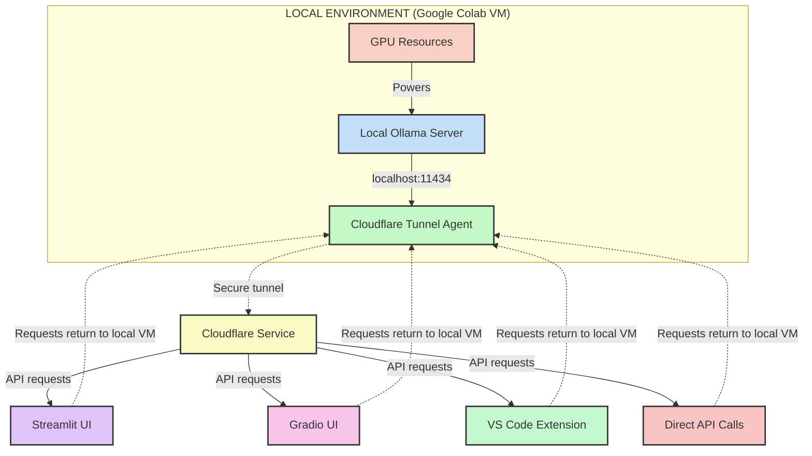

# 🧠 colab-llm

Run **local LLM models on Google Colab** and access them remotely via API — ideal for lightweight, cost-effective development and testing using [Ollama](https://ollama.com/) and [Cloudflare Tunnel](https://developers.cloudflare.com/cloudflare-one/connections/connect-apps/).

> ✅ Access your Colab-hosted LLM API from anywhere — even inside VS Code using the [ROO Code](https://marketplace.visualstudio.com/items?itemName=RooVeterinaryInc.roo-cline) extension or our built-in Streamlit UI!

---

## 🧩 Features

- 🔥 Run advanced LLMs (like Qwen, LLaMA3, Mistral, DeepSeek) in Colab using [Ollama](https://ollama.com/)
- 🌐 Expose the model via secure public URL using `cloudflared`
- 🧑‍💻 Integrate with [ROO Code](https://roo.dev) in VS Code for seamless coding assistance
- ✅ Automatically detects and waits for Ollama to be ready before tunneling
- 💡 Simple, professional, and reusable setup

---

## 🛠️ Requirements

- A Google Colab account
- A GPU runtime (preferably **T4 High-RAM** or better)
- No installation or cloud account needed for Cloudflare tunneling

---

## 📝 How It Works

### System Architecture

The architecture preserves the **100% local** nature of the LLM processing:

1. **Google Colab VM**: Provides the GPU compute environment where all processing occurs
2. **Local Ollama Server**: Runs locally within the Colab VM, handling model inference
3. **Cloudflare Tunnel**: Creates a secure tunnel from localhost to a public URL (no data processing occurs at Cloudflare)
4. **Public URL**: A randomly generated .trycloudflare.com address that securely forwards requests to your local Ollama instance
5. **Client Interfaces**:
   - **Streamlit UI**: A standalone web interface for conversing with your model
   - **Gradio UI**: An alternative interface built directly into the notebooks
   - **VS Code Extension**: Connect through ROO Code for coding assistance
   - **Direct API**: Call the API directly from any application

**Important**: All requests through the Cloudflare tunnel are securely forwarded to your local Ollama server. No inference or processing happens in the cloud - it all stays within your Colab VM.

### Setup Process

1. Installs and launches **Ollama** in the background of the Colab VM
2. Pulls the selected model (e.g., `maryasov/qwen2.5-coder-cline:7b-instruct-q8_0`)
3. Waits until Ollama is running and responsive on the VM's localhost
4. Starts a **Cloudflare tunnel** to expose `http://localhost:11434` securely
5. Provides a public `.trycloudflare.com` URL for API access
6. Offers a Streamlit UI for easy interaction with your model

---

### ▶️ Usage Instructions

Follow these steps to get your local LLM running in Colab and accessible via public API:

1. **Import the `.ipynb` notebook into your Google Colab**  
   - Open [colab.research.google.com](https://colab.research.google.com) and upload the notebook.

2. **Choose the runtime as `T4 GPU`**  
   - Go to `Runtime > Change runtime type` → select:
     - Hardware accelerator: **GPU**
     - GPU type: **T4**
   - **Note: Colab GPU sessions last up to ~3 hours before disconnecting. Then you can restart it.**

3. **Run all cells**  
   - Click `Runtime > Run all`  
   - Wait for the cells to complete. Model download can take a few minutes.

4. **Verify the API is working in Step 7**  
   - You'll see a generated public `trycloudflare.com` URL
   - The cell will also run a test `curl` request

5. **Click the public link**  
   - You should see the message: **“Ollama is running”**
   - This confirms the API is live and ready to be used from tools like **curl** or **ROO Code in VS Code**

---

## 💡 Use Options

### Chat Interfaces

#### Streamlit UI

For a standalone, feature-rich chat interface:

1. Run the Streamlit app provided in this repository
2. Enter the Cloudflare tunnel URL in the settings
3. Select your model and customize parameters
4. Chat with your local LLM through a clean web interface

#### Gradio UI (Built into Notebooks)

For an instant, in-notebook chat experience:

1. Run the notebook cells to start Ollama and create the tunnel
2. The final cells will launch a Gradio interface
3. A public Gradio URL will be generated for sharing
4. Use this interface for quick testing without leaving Colab

### ROO Code (VS Code Extension)

For coding assistance:

1. Install [ROO Code extension](https://marketplace.visualstudio.com/items?itemName=RooVeterinaryInc.roo-cline)
2. Open extension settings
3. Choose API Provider as **Ollama**
4. Paste the public URL from Colab (e.g. `https://bold-sky-1234.trycloudflare.com`) **(Do not include `/` at the end of the link)**
5. Choose your model
6. Done! You can now prompt your Colab-hosted model from your local VS Code 💬

---

## 🤝 Contributions

Feel free to open issues, suggest improvements, or submit pull requests. Let's make local model hosting accessible for everyone!

## Credits

- [enescingoz/colab-llm](https://github.com/enescingoz/colab-llm)
- [oobabooga/text-generation-webui](https://github.com/oobabooga/text-generation-webui)